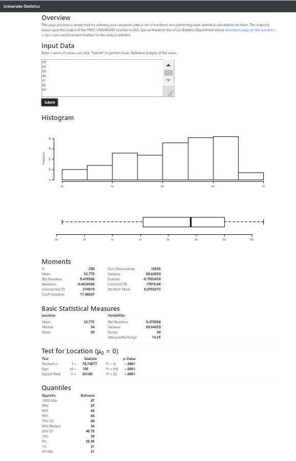

# Univariate Stats Dashboard

## Overview

This is a really simple web page, but it's something I've always wanted to
create: a simple way to put in a univariate data set and produce summary plots
and statistics.  An input box allows the user to enter data.  This data can
be:

* Comma-separated
* Whitespace-separated (including spaces, tabs, or newlines)

After hitting submit the web page will produce:

* Histogram
* Box-and-whiskers plot
* Summary statistics

The summary statistics are copied from the PROC UNIVARIATE in SAS (one of my
favorite functions from back in the college days).

## Statistical Definitions

You can mouse over many of the labels in the summary stats section of the page to see definitions.  These definitions were taken from https://stats.idre.ucla.edu/sas/output/proc-univariate/ with only slight modifications.

## Screenshot



## Lessons Learned

This is the first time I used a custom HTML template for a shiny dashboard.
Two webpages were very helpful in building this:

* https://shiny.rstudio.com/articles/html-ui.html
* https://shiny.rstudio.com/articles/templates.html

Both pages were necessary to make sure you did things right.  Some of the mistakes
I made along the way (which are documented in the links above):

* Not knowing how to insert an action button (solution: you can create it in R and pass it to ```htmlTemplate()``` or create it in your HTML template with ```{{ actionButton(...) }}```)
* Forgetting the ```{{ headContent() }}``` macro to let Shiny insert its own CSS and JavaScript dependencies
* Forgetting the ```shiny-plot-output``` or ```shiny-text-output``` class on elements that will output content from Shiny

## TO-DO / Ideas

* include additional proc univariate output:
  * test for normality
* let user select number of bins for histogram (and color?)
* add "about" page
* distribution fitting would also be sweet
  * maybe a separate tab?
  * could also overlay distributions with histogram
* maybe a separate tab for time series analysis as well (and forecasting?)
  * nah... this is too specialized.  separate app.
